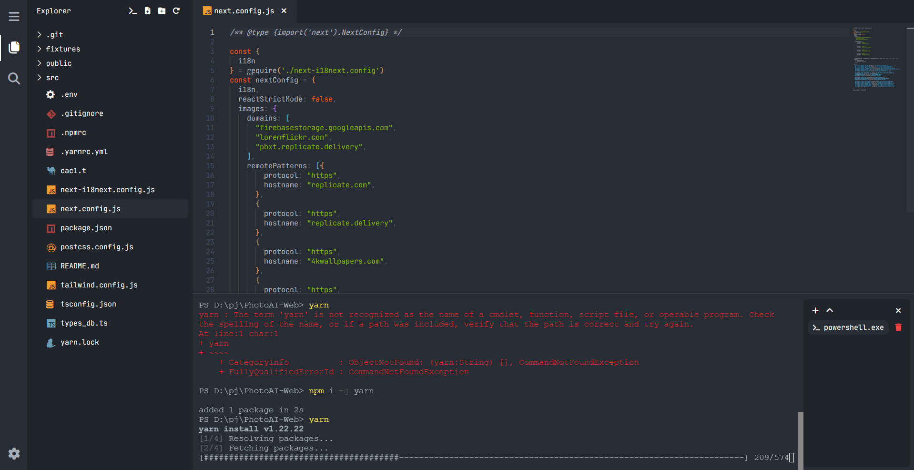

# UnderScode - Simple Code Editor

  

This is a simple code editor as a hobby project. It's a great starting point for customization or collaboration! Feel free to check it out on [UnderScode Repo](https://github.com/vuongle2609/Underscode-Simple-Code-Editor).

Underscode using [Monaco Editor](https://microsoft.github.io/monaco-editor/) under the hood, support basic syntax highlighting in many languages. And [Node pty](https://www.npmjs.com/package/node-pty) for integrate terminal.

[Download here!](https://github.com/vuongle2609/Underscode-Simple-Code-Editor/releases/download/1.0/Underscode-Setup.exe):snail:

## Features Todo

| Feature                   | Status             |
| ------------------------- | ------------------ |
| Add Shortcuts             | :x:                |
| Chokidar for file changes | :heavy_check_mark: |
| Settings                  | :x:                |
| Source control            | :x:                |
| Choose terminal type      | :x:                |
